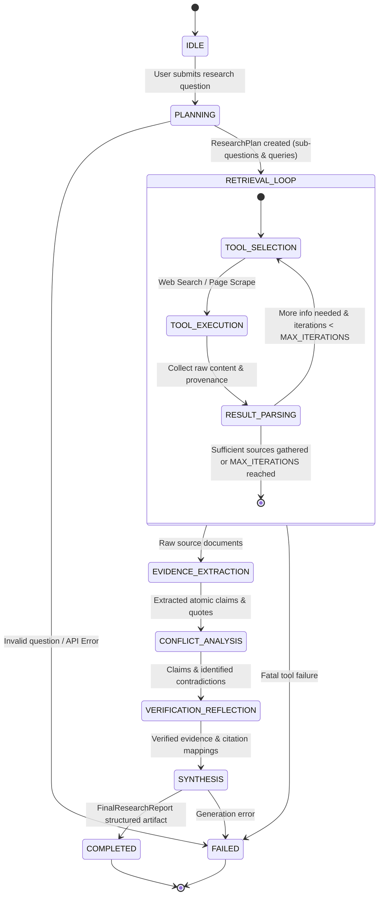

# AI Research Analyst: Architecture & System Specification

## 1. Repository Inspection
- Repository is clean with an initial `README.md`.
- Runtime environment:
  - Python: 3.11.9
  - Node: v21.6.2
  - npm: 10.2.4
  - OS: Windows (PowerShell)

---

## 2. System Architecture

The **AI Research Analyst** is architected as a clean, decoupled, interview-defensible agentic system. It deliberately avoids bloated multi-agent frameworks in favor of an **orchestrated state machine** where every transition, tool call, evidence extraction, verification check, and synthesis step is explicit, inspectable, and reproducible.

```
┌────────────────────────────────────────────────────────────────────────┐
│                   React + Vite + Tailwind CSS Dashboard                │
│   (Timeline, Research Plan, Sources, Evidence, Conflicts, Report View)  │
└───────────────────────────────────┬────────────────────────────────────┘
                                    │ SSE / REST API
                                    ▼
┌────────────────────────────────────────────────────────────────────────┐
│                        FastAPI Application Server                       │
│  - REST Endpoints (/api/research/start, /api/research/sessions, etc.)  │
│  - Server-Sent Events (SSE) Streamer for Real-Time Execution Events   │
│  - SQLite Session & Report Persistence (SQLAlchemy)                    │
└───────────────────────────────────┬────────────────────────────────────┘
                                    │
                  ┌─────────────────┴─────────────────┐
                  ▼                                   ▼
┌───────────────────────────────────┐   ┌────────────────────────────────┐
│   Agentic State Machine Engine    │   │      Retrieval & Tool Core     │
│   - Planning Phase                │   │  - DuckDuckGo / Tavily Search  │
│   - Bounded Tool-Calling Loop     │   │  - Resilient Web Text Scraper  │
│   - Evidence Extraction & Mining  │   │  - Source Provenance Tracker   │
│   - Cross-Source Conflict Engine  │   │  - Offline Mock Engine (Evals) │
│   - Grounded Verification Stage   │   └────────────────────────────────┘
│   - Structured Synthesis Engine   │
└─────────────────┬─────────────────┘
                  │
                  ▼
┌───────────────────────────────────┐
│        OpenAI Client Layer        │
│  - Structured Outputs (Pydantic)  │
│  - Function / Tool Calling Engine │
│  - Guardrails & Anti-Hallucination│
└─────────────────┬─────────────────┘
```

---

## 3. Agent Workflow / State Machine

The agent operates as a **Bounded Finite State Machine (FSM)**. Unlike unbounded autonomous loops that can spin indefinitely or consume excess tokens, this system enforces explicit stage transitions and hard iteration limits.



### Stage Details:
1. **PLANNING**: The LLM analyzes the user question and returns a `ResearchPlan` containing decomposed sub-questions, required information, and search queries.
2. **RETRIEVAL_LOOP (Bounded Tool Calling)**:
   - Max iterations: Bounded to 3–5 iterations.
   - The LLM receives sub-questions and current findings, invoking tools:
     - `web_search(query: str, max_results: int)`
     - `extract_page_content(url: str)`
   - Results are deduplicated and tracked with provenance metadata.
3. **EVIDENCE_EXTRACTION**: The LLM parses retrieved texts into discrete `EvidenceItem` records with supporting quotes, source URLs, confidence scores, and sub-question tags.
4. **CONFLICT_ANALYSIS**: A dedicated comparison prompt cross-references extracted claims across sources to detect contradictions, nuanced divergences, or timeline differences.
5. **VERIFICATION_REFLECTION**: Evaluates whether each key claim is supported by retrieved quotes. Calculates a source grounding score and flags unsupported statements.
6. **SYNTHESIS**: Generates a comprehensive `FinalResearchReport` with executive summary, methodology, key findings, comparative tables, conflict analysis, limitations, and cited references.

---

## 4. Pydantic Schemas

```python
from pydantic import BaseModel, Field, HttpUrl
from typing import List, Optional, Dict, Literal
from datetime import datetime

# --- Planning ---
class SubQuestion(BaseModel):
    id: str = Field(description="Unique identifier e.g., 'sub-1'")
    question: str = Field(description="Decomposed research sub-question")
    purpose: str = Field(description="Why answering this is crucial for the main question")
    suggested_queries: List[str] = Field(description="Suggested search engine queries")

class ResearchPlan(BaseModel):
    main_question: str = Field(description="The original user research question")
    clarified_scope: str = Field(description="Clarified scope and key dimensions to investigate")
    sub_questions: List[SubQuestion] = Field(description="List of 3 to 5 focused sub-questions")
    search_strategy: str = Field(description="Overall retrieval and search strategy")
    estimated_iterations: int = Field(default=3, description="Estimated tool iterations needed")

# --- Search & Tools ---
class SearchResult(BaseModel):
    id: str
    title: str
    url: str
    snippet: str
    content: Optional[str] = None
    query: str
    timestamp: datetime = Field(default_factory=datetime.utcnow)

class ToolCallLog(BaseModel):
    tool_name: str
    arguments: Dict[str, str]
    summary_result: str
    timestamp: datetime = Field(default_factory=datetime.utcnow)

# --- Evidence ---
class EvidenceItem(BaseModel):
    id: str = Field(description="Unique evidence ID e.g., 'ev-1'")
    sub_question_id: str = Field(description="ID of the sub-question addressed")
    claim: str = Field(description="Atomic claim or finding extracted from the source")
    verbatim_quote: str = Field(description="Direct quotation or snippet from source")
    source_url: str = Field(description="URL of source")
    source_title: str = Field(description="Title of source document")
    confidence_score: float = Field(ge=0.0, le=1.0, description="Confidence in accuracy (0.0 to 1.0)")
    contradiction_potential: bool = Field(default=False, description="Whether this finding diverges from other sources")

# --- Conflict Detection ---
class ConflictItem(BaseModel):
    id: str = Field(description="Unique conflict ID e.g., 'conf-1'")
    topic: str = Field(description="The specific sub-topic or claim under dispute")
    claim_a: str = Field(description="Perspective or claim A")
    source_a_url: str = Field(description="Source URL for claim A")
    claim_b: str = Field(description="Perspective or claim B")
    source_b_url: str = Field(description="Source URL for claim B")
    possible_reason: str = Field(description="Explanation for divergence (methodology, time period, definition)")
    severity: Literal["minor_nuance", "moderate_divergence", "direct_contradiction"]

# --- Verification & Reflection ---
class ClaimVerification(BaseModel):
    claim_text: str
    supporting_evidence_ids: List[str]
    is_grounded: bool = Field(description="True if claim is directly backed by evidence quote")
    verification_notes: str = Field(description="Reflection on whether the claim is fully supported or overreaching")
    grounding_score: float = Field(ge=0.0, le=1.0)

class VerificationResult(BaseModel):
    claims_evaluated: List[ClaimVerification]
    overall_grounding_score: float = Field(ge=0.0, le=1.0)
    unsupported_claims_removed_or_flagged: List[str]
    verification_passed: bool

# --- Final Synthesis ---
class ComparisonRow(BaseModel):
    dimension: str
    values: Dict[str, str]

class ComparisonTable(BaseModel):
    title: str
    headers: List[str]
    rows: List[ComparisonRow]

class KeyFinding(BaseModel):
    headline: str
    detailed_explanation: str
    evidence_ids: List[str]
    source_citations: List[str]  # e.g., ["[1]", "[3]"]
    confidence: Literal["high", "moderate", "low"]

class ReferenceItem(BaseModel):
    citation_index: int  # 1, 2, 3...
    title: str
    url: str
    key_contribution: str

class FinalResearchReport(BaseModel):
    title: str
    executive_summary: str
    research_methodology: str
    key_findings: List[KeyFinding]
    comparison_tables: List[ComparisonTable] = []
    conflicting_information: List[ConflictItem] = []
    limitations: List[str]
    conclusion: str
    references: List[ReferenceItem]
    generated_at: datetime = Field(default_factory=datetime.utcnow)
```
