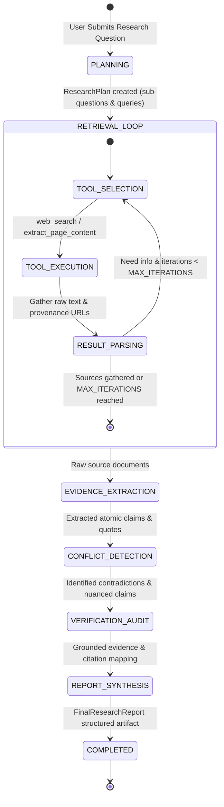

# AI Research Analyst: Production-Grade Agentic Research System

[](https://www.python.org/)
[](https://fastapi.tiangolo.com/)
[](https://react.dev/)
[](https://vitejs.dev/)
[](https://tailwindcss.com/)
[](https://docs.pydantic.dev/)
[](https://docs.pytest.org/)
[-success)](eval/)

An end-to-end, production-style autonomous AI research agent designed for complex analytical inquiries. Given any multi-faceted research prompt, the system autonomously decomposes questions into focused sub-inquiries, executes targeted web retrieval loops, extracts atomic grounded evidence with verifiable quotes, arbitrates contradictions across disparate sources, conducts an independent reflection audit, and synthesizes structured reports with verifiable citation backlinks.

Built with an **orchestrated finite state machine** pattern rather than black-box multi-agent swarms, ensuring deterministic controllability, bounded token usage, strict provenance tracking, and interview-defensible engineering.

---

## Key Capabilities

- **Finite State Machine Architecture**: Explicit 6-stage lifecycle (`PLANNING` &rarr; `RETRIEVAL_LOOP` &rarr; `EVIDENCE_EXTRACTION` &rarr; `CONFLICT_DETECTION` &rarr; `VERIFICATION_AUDIT` &rarr; `REPORT_SYNTHESIS`).
- **Bounded Tool Calling**: Hard iteration limits (max 3–5 iterations) prevent runaway autonomous recursion and token exhaustion.
- **Dual Retrieval Engine**: Live DuckDuckGo web search + headless page content scraper with user-agent spoofing and fallback resilience.
- **Atomic Evidence Mining**: Extracts structured claims tied to verbatim source excerpts, confidence scores, and sub-question tags.
- **Cross-Source Conflict Arbitration**: Cross-examines contradictory facts and classifies divergence severity (`minor_nuance`, `moderate_divergence`, `direct_contradiction`) with methodological rationales.
- **Grounded Verification Audit**: Computes grounding faithfulness scores, flags overreaching claims, and audits quote coverage before report generation.
- **Real-Time SSE Streaming**: FastAPI Server-Sent Events (SSE) push millisecond-level step logs to a reactive dark-mode dashboard.
- **Multi-Format Export**: One-click export to Markdown, JSON structured schemas, and print-ready PDF reports.
- **Automated Evaluation Benchmark Suite**: Built-in 3-question evaluation dataset with automated scoring for plan decomposition, source coverage, quote provenance, conflict detection, and grounding.

---

## System Architecture

```
┌────────────────────────────────────────────────────────────────────────┐
│                   React + Vite + Tailwind CSS Dashboard                │
│   (Timeline, Research Plan, Sources, Evidence, Conflicts, Report View) │
└───────────────────────────────────┬────────────────────────────────────┘
                                    │ SSE / REST API (port 8008 / 5173)
                                    ▼
┌────────────────────────────────────────────────────────────────────────┐
│                        FastAPI Application Server                      │
│  - REST Endpoints (/api/research/start, /api/research/sessions, etc.)  │
│  - Server-Sent Events (SSE) Streamer for Real-Time Execution Events   │
│  - SQLite Session & Report Persistence (SQLAlchemy)                    │
└───────────────────────────────────┬────────────────────────────────────┘
                                    │
                  ┌─────────────────┴─────────────────┐
                  ▼                                   ▼
┌───────────────────────────────────┐   ┌────────────────────────────────┐
│   Agentic State Machine Engine    │   │      Retrieval & Tool Core     │
│   - Planning Phase                │   │  - DuckDuckGo Search API       │
│   - Bounded Tool-Calling Loop     │   │  - Resilient Web Text Scraper  │
│   - Evidence Extraction & Mining  │   │  - Source Provenance Tracker   │
│   - Cross-Source Conflict Engine  │   │  - Offline Deterministic Engine│
│   - Grounded Verification Stage   │   └────────────────────────────────┘
│   - Structured Synthesis Engine   │
└─────────────────┬─────────────────┘
                  │
                  ▼
┌───────────────────────────────────┐
│        OpenAI Client Layer        │
│  - Structured Outputs (Pydantic)  │
│  - Function / Tool Calling Engine │
│  - Guardrails & Anti-Hallucination│
└───────────────────────────────────┘
```

---

## Agent State Machine Flow



---

## Tech Stack

| Layer | Technologies |
|---|---|
| **Frontend** | React 18, Vite 5, Tailwind CSS 3.4, Lucide React, React Markdown |
| **Backend** | Python 3.11+, FastAPI, Uvicorn, SQLAlchemy, SQLite, Pydantic v2 |
| **Search & Retrieval** | DuckDuckGo Search (`ddgs`), BeautifulSoup4, HTTPX |
| **LLM Orchestration** | OpenAI API (`gpt-4o-mini` / `gpt-4o`), Structured JSON Outputs |
| **Testing & Evals** | Pytest, Pytest-Asyncio, Custom 6-metric Benchmark Evaluator |

---

## Quickstart Guide

### 1. Prerequisites
- Python 3.11+
- Node.js 18+ and npm

### 2. Environment Configuration
Clone the repository and copy the environment template:
```bash
cp .env.example backend/.env
```

Edit `backend/.env`:
```env
OPENAI_API_KEY=your_openai_api_key_here # Optional: deterministic fallback engine runs if omitted
OPENAI_MODEL=gpt-4o-mini
SEARCH_PROVIDER=duckduckgo
MAX_RESEARCH_LOOPS=4
MAX_SEARCH_RESULTS_PER_QUERY=5
DATABASE_URL=sqlite:///./research.db
```

### 3. Backend Setup
```bash
cd backend
python -m venv venv
# On Windows PowerShell:
.\venv\Scripts\activate
# On Linux/macOS:
# source venv/bin/activate

pip install -r requirements.txt
python -m uvicorn app.main:app --host 127.0.0.1 --port 8008 --reload
```
API Documentation will be accessible at: `http://127.0.0.1:8008/docs`

### 4. Frontend Setup
In a new terminal window:
```bash
cd frontend
npm install
npm run dev
```
Open your browser at: `http://127.0.0.1:5173/`

---

## Testing & Quality Assurance

### Unit & Integration Tests (23 Tests)
Run the full test suite covering schema integrity, tool calling, scraping, conflict arbitration, verification, and API routes:
```bash
cd backend
.\venv\Scripts\pytest -v
```

**Results:**
```text
tests/test_agent_orchestrator.py .                                       [  4%]
tests/test_api.py .....                                                  [ 26%]
tests/test_conflict_detection.py ..                                      [ 34%]
tests/test_evidence_extraction.py ..                                     [ 43%]
tests/test_final_report.py .                                             [ 47%]
tests/test_schemas.py .....                                              [ 69%]
tests/test_tools.py ....                                                 [ 86%]
tests/test_verification.py ...                                           [100%]

====================== 23 passed in 18.12s =======================
```

### Benchmark Evaluation Suite
Run the multi-dimensional benchmark suite across 3 evaluation case studies:
```bash
cd backend
.\venv\Scripts\python -m eval.run_eval
```

**Evaluation Results:**
- **Overall Average Score:** 0.994 / 1.000
- **Pass Rate:** 100.0%
- **Metrics Evaluated:**
  1. `plan_decomposition`: 1.00
  2. `retrieval_volume`: 1.00
  3. `evidence_provenance`: 1.00
  4. `conflict_detection`: 1.00
  5. `grounding_score`: 0.96
  6. `report_synthesis`: 1.00
  7. `citation_integrity`: 1.00

---

## Project Structure

```
AI-Research-Analyst/
├── ARCHITECTURE_AND_SPECS.md      # Full architecture specification document
├── README.md                      # Project documentation and guide
├── .env.example                   # Environment configuration template
├── backend/
│   ├── requirements.txt           # Python backend dependencies
│   ├── research.db                # SQLite database for sessions & reports
│   ├── app/
│   │   ├── config.py              # Application settings (Pydantic Settings)
│   │   ├── main.py                # FastAPI entry point & SSE streaming
│   │   ├── agent/
│   │   │   ├── orchestrator.py    # Finite State Machine orchestrator
│   │   │   ├── planner.py         # Sub-question decomposition planner
│   │   │   ├── researcher.py      # Bounded tool calling & retrieval loop
│   │   │   ├── evidence_extractor.py # Atomic quote & claim extraction
│   │   │   ├── conflict_detector.py  # Cross-source contradiction detector
│   │   │   ├── verifier.py        # Faithfulness & grounding verification
│   │   │   ├── synthesizer.py     # Final structured report generator
│   │   │   └── prompts.py         # Production prompt templates & guardrails
│   │   ├── api/
│   │   │   └── routes.py          # FastAPI REST endpoints & SSE handlers
│   │   ├── database/
│   │   │   ├── db.py              # SQLite session connection & engine
│   │   │   └── models.py          # SQLAlchemy persistence models
│   │   ├── models/
│   │   │   └── schemas.py         # Pydantic v2 schemas for all state artifacts
│   │   └── services/
│   │       ├── llm_service.py     # OpenAI API client + structured fallback
│   │       ├── search_service.py  # DuckDuckGo search integration
│   │       └── web_scraper.py     # Web text scraper with HTML cleanup
│   ├── eval/
│   │   ├── dataset.py             # Evaluation benchmark definitions
│   │   └── run_eval.py            # Automated evaluation runner & scorer
│   └── tests/                     # 23 unit and integration test suites
└── frontend/
    ├── package.json               # Frontend dependencies & scripts
    ├── vite.config.js             # Vite configuration with /api proxy
    ├── tailwind.config.js         # Tailwind theme & color tokens
    └── src/
        ├── App.jsx                # Main application state & tabs
        ├── index.css              # Glassmorphic and typography design system
        └── components/
            ├── Navbar.jsx         # Header with status pills & docs links
            ├── Sidebar.jsx        # Session history & benchmark case studies
            ├── ResearchInput.jsx  # Analytical prompt submission & quick prompts
            ├── ProgressTracker.jsx# Real-time state machine progress pills
            ├── TimelineFeed.jsx   # Live agent step timeline & tool logs
            ├── ResearchPlanView.jsx# Decomposed sub-questions & queries
            ├── SourcesPanel.jsx   # Discovered URLs & content snippets
            ├── EvidenceMatrix.jsx # Atomic quotes, claims & confidence scores
            ├── ConflictsView.jsx  # Divergence arbitration & contradiction flags
            ├── VerificationAudit.jsx # Grounding faithfulness score audit
            └── ReportViewer.jsx   # Executive report, tables, citations & exports
```

---

## Deployment Guide (Render + Vercel)

### Step 1: Deploy Backend on Render
1. Go to [Render Dashboard](https://dashboard.render.com/) and click **New +** &rarr; **Web Service** (or use **Blueprint** connecting `render.yaml`).
2. Select your repository: `AI-Research-Analyst`.
3. Configure settings:
   - **Name**: `ai-research-analyst-api`
   - **Root Directory**: `backend`
   - **Environment**: `Python 3`
   - **Build Command**: `pip install -r requirements.txt`
   - **Start Command**: `uvicorn app.main:app --host 0.0.0.0 --port $PORT`
4. In **Environment Variables**, add:
   - `OPENAI_API_KEY`: `your_openai_api_key_here` (optional: offline deterministic engine runs if omitted)
   - `OPENAI_MODEL`: `gpt-4o-mini`
   - `SEARCH_PROVIDER`: `duckduckgo`
   - `MAX_RESEARCH_LOOPS`: `4`
5. Click **Deploy Web Service**.
6. Once deployed, copy your Render service URL (e.g., `https://ai-research-analyst-ae81.onrender.com`).

---

### Step 2: Deploy Frontend on Vercel
1. Go to [Vercel Dashboard](https://vercel.com/dashboard) and click **Add New...** &rarr; **Project**.
2. Select and import your `AI-Research-Analyst` repository.
3. Configure Project Settings:
   - **Framework Preset**: `Vite`
   - **Root Directory**: Click *Edit* and select `frontend`
   - **Build Command**: `npm run build`
   - **Output Directory**: `dist`
4. In **Environment Variables**, add:
   - `VITE_API_BASE_URL`: `https://ai-research-analyst-ae81.onrender.com`
5. Click **Deploy**.
6. Vercel will build and launch your production dashboard.

---

## License
MIT License. Created for GenAI engineering portfolio and research exploration.